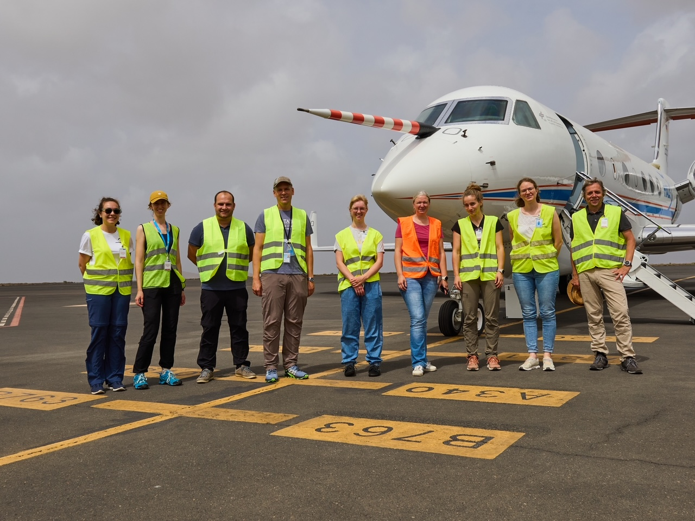
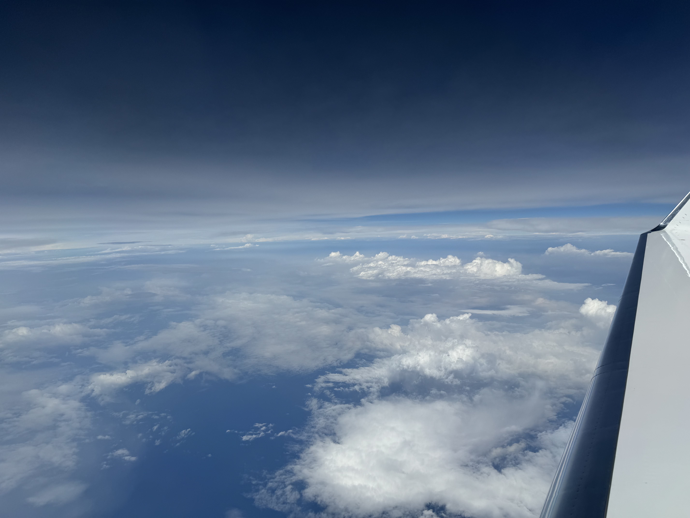

{logo}`PERCUSION`

# {front}`flight_id`

```{badges}
```

## Conditions

The flight had a developing easterly wave, with a prominent low-level vortex and a roll up of moisture near Cape Verde.  Forecasts suggested that the ITCZ could be edge intensified and moisture margin circles were chosen based on the 48 mm precipitable water forecast from ECMWF with four day lead, which verified well.  Dust was pronounced north of the iTCZ and winds within the ITCZ had a pronounced westerly component.   

## Execution

Flew what we hope will be a standard pattern, with an ITCZ cross section at altitude (FL410), three circles one on each moist margin of the ITCZ and one in the center, followed by a smaller circle that we tried to center over a region of earlier ATR measurements ENE of Mindelo.   Circle at north-margin was at FL 450, center and south margin circle at FL430, ATR circle at FL350.

## Impressions

- Moist layers and clouds within the ITCZ, seemed to be quite varied and mostly confined to below 6 km, where there was a persistent moist layer, capped by a persistent dry slot.  This was evident well north of the ITCZ where it was associated with a stratiform cloud layer. (BS)

- Witin the ITCZ there seemed to be medium-sized clusters consisting of multi-cellular convective elements mostly below the 6km capping layer.  At the edges convection was deeper.  Despite a pronouced RH maximum at about 12 km, trace amounts of condensate, well above this layer could be found, and were often quite visible to the lidar, even if it seemed like the stratiform cloud top was closer to the 12km humidity peak.  The disperse thin-ice clouds extended above the aircraft at its highest flight level in several places.  Within the ITCZ the boundary layer was low, or even absent, i.e., low cloud bases.  Some soundings seemed to show a near surface jet, or acceleration of the winds, most pronounced in the southerly component of the wind.  Winds through the depth of the troposphere were light and variable. (BS)

- Both north and outh of the ITCZ there was a pronounced trade-inversion, which from memory seemed deeper on the southern side and more prounced (7K) on the northern side.  Much if not all of this was due to the atmosphere being warmer rather than the surface being colder, which could mean that the $\theta_\mathrm{v}$ profiles would show a less pronounced (or no) feature due to moisture compensation. Along the ATR circle there was an elevenated stratiform layer at about 6 km, hence two pronounced layer of stratiform clouds. (BS)

```{note}
First PERCUSION research flight. First EarthCARE underflight, first divergence measurements within and across the ITCZ
```

## Instrument Status

----
  - name: Bahamas
    - operator: Tommy ? 
    - remarks: no known problems
  - name: HAMP 
    - operator: Clara Bayley 
    - remarks: KV band remote desktop on HAMP laptop wasn't working.  No radiometer calibration.
  - name: SpecMACS 
    - operator: Veronika Pörtge
    - remarks: freezing on side windows above FL350... started measurements around 12:30 UTC due to temperature problems.
  - name: SMART/VELOX 
    - operator: Anna Luebke
    remarks: problems with motion compensation for SMART, hence stabelized with respect to fuselage
  - name: Dropsondes 
    - operator: Helene Glöckner 
    - remarks: Had to omit a drop on second circle due to aircraft conflict, five sondes with no launc
  - name: WALES 
    - operator: Silke Groß
    - remarks: Some issues on HSRL
----

## Snapshots





## Instrument quicklooks

```{figure}

:alt: Deep convection.

Development of deep-convective clouds.
```

